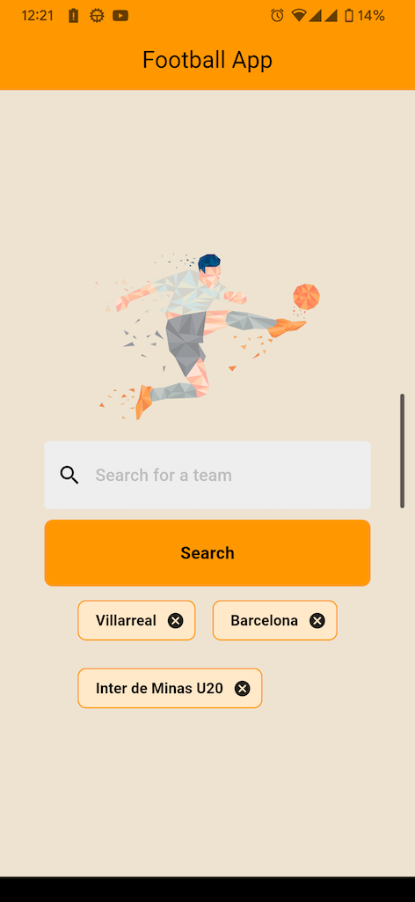
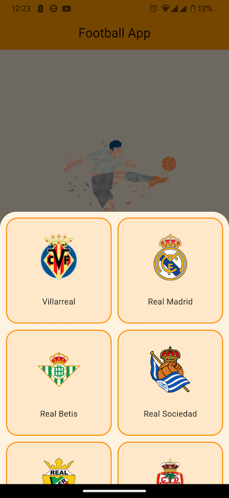
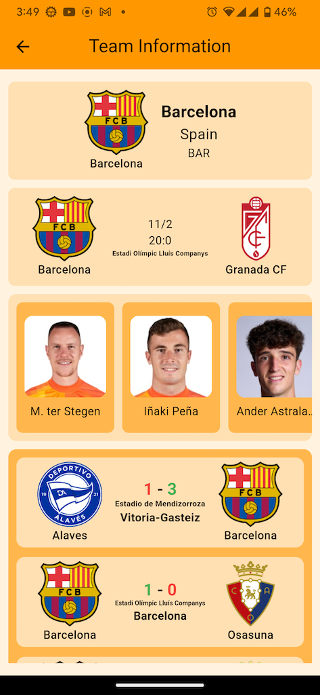
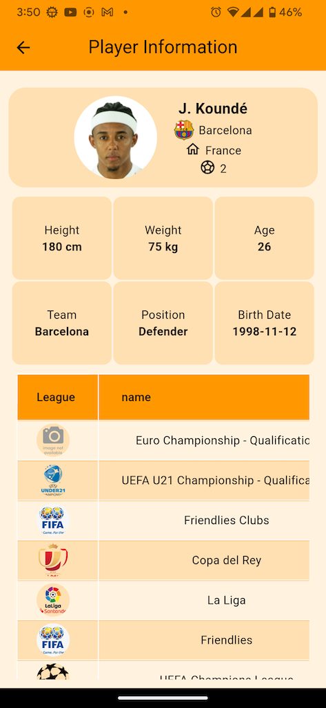
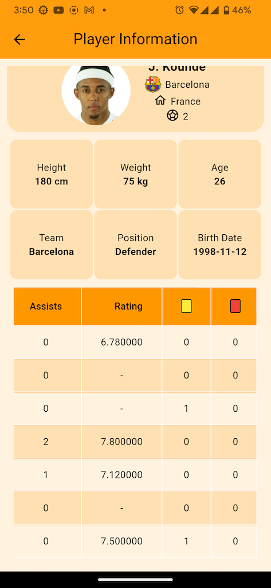

# Football App

Welcome to the Football App repository! This Flutter application allows users to search for football teams, view upcoming matches, and explore player information.

## Features

- Search for football teams
- View upcoming match information
- Display the last 7 matches for a team
- Explore player details including age, weight, goals, and more

## Getting Started

To run the Football App on your local machine, follow these steps:

1. Clone this repository to your local machine.
2. Ensure you have Flutter installed. If not, follow the instructions [here](https://flutter.dev/docs/get-started/install).
3. Open the project in your preferred IDE or text editor.
4. Copy the file `env_example` and rename it as `.env`.
5. Obtain your API key from this link and add it to the `.env` file: [https://dashboard.api-football.com/profile?access](https://dashboard.api-football.com/profile?access). (Be careful, you have only 100 requests per day.)
6. Run `flutter pub get` to install dependencies.
7. Connect a device or start an emulator.
8. Run `flutter run` to launch the application.

## Screenshots

